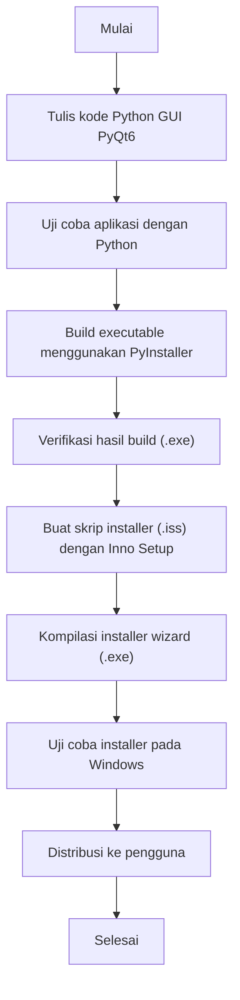

---


### 🪶 Project: **Simple Text Editor for Windows (PyQt + PyInstaller + Inno Setup)**

#### 🧩 Deskripsi

Proyek ini adalah contoh lengkap pembuatan aplikasi desktop Python dengan GUI menggunakan **PyQt6**, yang dikemas menjadi **file `.exe`** menggunakan **PyInstaller**, dan kemudian dibuat **installer wizard profesional** menggunakan **Inno Setup**.

Proyek ini menggambarkan alur kerja nyata seorang developer software Windows — dari pengembangan kode, kompilasi, hingga distribusi ke pengguna akhir.

---

## 🚀 Alur (Flow) Proyek



---

## 🧠 Detail Tahapan

### 1️⃣ Pengembangan Aplikasi (PyQt6)

File utama: `main.py`  
Fitur:

- Buka file teks (`Ctrl+O`)
    
- Simpan file teks (`Ctrl+S`)
    
- Tampilan sederhana dan responsif
    

Contoh struktur proyek:

```
Softwareinstaller wizard/
├─ main.py
├─ Env/
└─ dist/
```

---

### 2️⃣ Build Executable dengan PyInstaller

Perintah:

```bash
pyinstaller --noconsole --onefile --name "SimpleTextEditor" main.py
```

Hasil:

```
dist/
└─ SimpleTextEditor.exe
```

---

### 3️⃣ Pembuatan Installer Wizard (Inno Setup)

Gunakan skrip `.iss` seperti:

```ini
[Setup]
AppName=Simple Text Editor
AppVersion=1.0
DefaultDirName={autopf}\SimpleTextEditor
OutputDir=dist_installer
OutputBaseFilename=SimpleTextEditorSetup

[Files]
Source: "dist\SimpleTextEditor.exe"; DestDir: "{app}"

[Icons]
Name: "{group}\Simple Text Editor"; Filename: "{app}\SimpleTextEditor.exe"
Name: "{userdesktop}\Simple Text Editor"; Filename: "{app}\SimpleTextEditor.exe"
```

Hasil build:  
`dist_installer/SimpleTextEditorSetup.exe`

---

## ⚙️ Struktur Akhir Proyek

```
Softwareinstaller wizard/
│
├─ main.py
├─ dist/
│   └─ SimpleTextEditor.exe
├─ dist_installer/
│   └─ SimpleTextEditorSetup.exe
├─ installer_script.iss
├─ README.md
└─ Env/
```

---

## 📦 Hasil Akhir

✅ Aplikasi siap digunakan di Windows  
✅ Dapat diinstal melalui wizard profesional  
✅ Shortcut otomatis di desktop & Start Menu

---

## 💡 Ide Pengembangan Lanjutan

### 🔧 1. Kustomisasi Installer Wizard

- Tambahkan _license agreement_ (EULA)
    
- Tambahkan _uninstaller_
    
- Tambahkan logo dan ikon aplikasi `.ico`
    
- Registrasikan path ke **Environment Variables**
    
- Tulis entri di **Windows Registry**
    
- Tambahkan _progress animation_ atau _splash screen_
    

---

### 📦 2. Optimasi Build PyInstaller

- Gunakan `--onefile` untuk versi tunggal
    
- Gunakan `--noconsole` untuk menyembunyikan terminal
    
- Tambahkan file resource seperti ikon, font, atau konfigurasi
    
- Kurangi ukuran file dengan _UPX compression_
    

---

### 🧠 3. Pengembangan Aplikasi

- Tambahkan fitur **find & replace**
    
- Tambahkan **dark mode**
    
- Buat versi **multi-tab editor**
    
- Simpan **autosave & recent files**
    
- Dukungan untuk **encoding lain (UTF-8, ANSI)**
    

---

### ☁️ 4. Distribusi & Maintenance

- Buat versi **portable (tanpa installer)**
    
- Tambahkan **auto-update system**
    
- Buat **installer versi online/offline**
    
- Publikasikan ke situs pribadi atau GitHub Release
    

---

### 📚 5. Integrasi Dokumentasi & Logging

- Tambahkan **menu Help / About**
    
- Gunakan `logging` untuk mencatat error
    
- Dokumentasikan dengan **docstring dan sphinx**
    

---

## 👨‍💻 Author

**Dahdi Pdk**  
Pengembang independen & peneliti perangkat lunak  
Project: _Software for Windows Series_

---

Apakah kamu ingin aku bantu buatkan file `README.md` ini dalam format siap disimpan (file asli `.md`) di folder proyekmu?  
Aku bisa langsung hasilkan file-nya agar kamu tinggal copy ke folder project.

